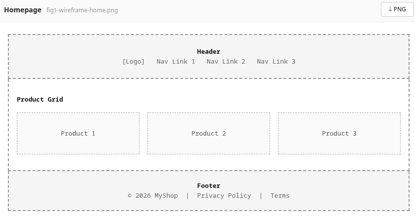
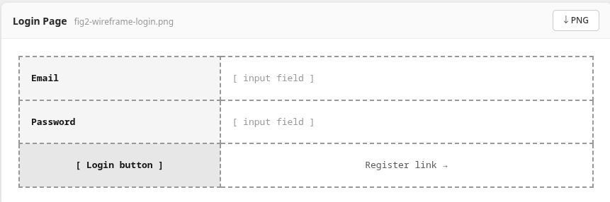
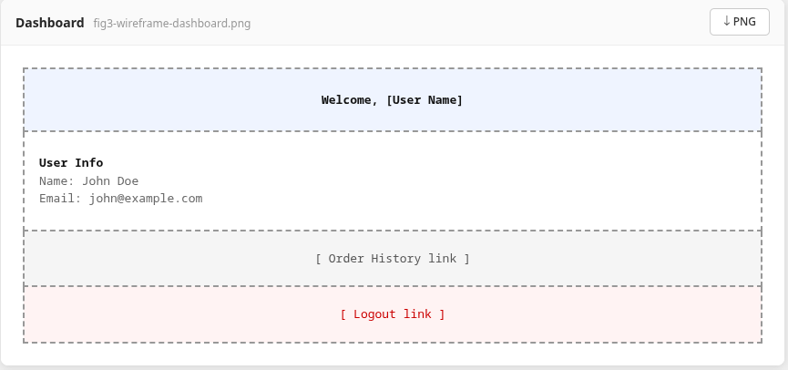
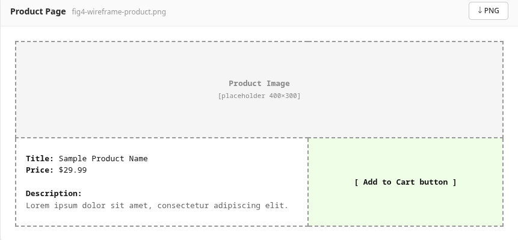
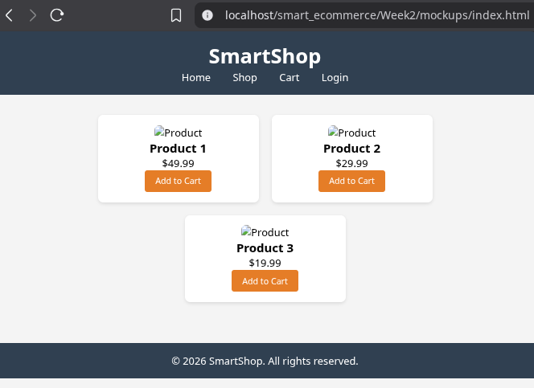

# Week 2 – UI/UX and Design Foundations (Wireframes & GUI Mockups)

**Student:** Kennedy Karani  
**Registration:** BBIT/2024/56963  
**Date:** 2026-06-02

## Objective
Design wireframes and GUI mockups for the Smart E-Commerce web application, plan the project proposal, and document everything with screenshots.

## Step-by-Step Actions

### 1. Wireframes
I used claude running as part of figma make - a web application builder that lets you create React + Tailwind apps through conversation (online)
to sketch four key screens:

- **Homepage** – product grid, navigation.  
    
  *Fig 1: Wireframe of the homepage showing product cards and top navigation.*

- **Login page** – email and password fields, register link.  
    
  *Fig 2: Wireframe of the login screen.*

- **Dashboard** – welcome message, order history link, account settings.  
    
  *Fig 3: Wireframe of the customer dashboard.*

- **Product page** – product image, description, price, add-to-cart button.  
    
  *Fig 4: Wireframe of the single product view.*

### 2. GUI Mockup (HTML/CSS)
I built a responsive homepage mockup using HTML and CSS (no backend). The design uses a dark blue header, orange buttons, and a flexible product grid. I tested it on desktop and mobile.

**Desktop view**  
  
*Fig 5: GUI mockup of the homepage on a desktop screen.*

**Mobile responsive view** (using browser dev tools)  
  
*Fig 6: Same page rendered on a 375px wide screen – cards stack vertically.*

### 3. Project Proposal

I wrote `proposal.md` (see in this folder) summarizing the theme, features, technologies, and planned folder structure.

### 4. Technologies Selected

- PHP + MySQL (MariaDB) as backend.
- Bootstrap 5 for responsive design.
- Git/GitHub for version control.

## Reflection (100 words)

This 3 hours I focused on planning the user experience before coding.

1.I learned that wireframes help visualise the layout and user flow without getting lost in technical details. 

2.I used figma + claude ai to create simple but clear wireframes for the homepage, login, dashboard, and product page.

3.The HTML/CSS mockup gave me a chance to test colour schemes and responsiveness – I chose a dark header with orange call-to-action buttons for contrast. 

4.I also wrote a project proposal to clarify the scope. All designs are saved in the `Week2/screenshots/` folder and referenced in this logbook.
