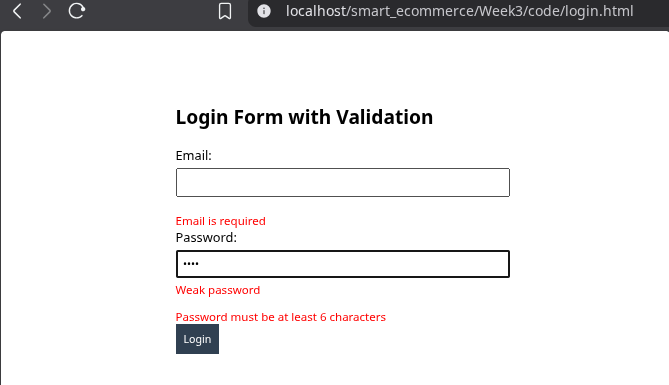
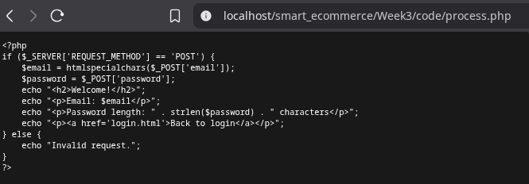
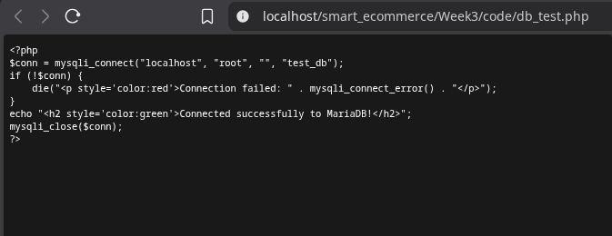
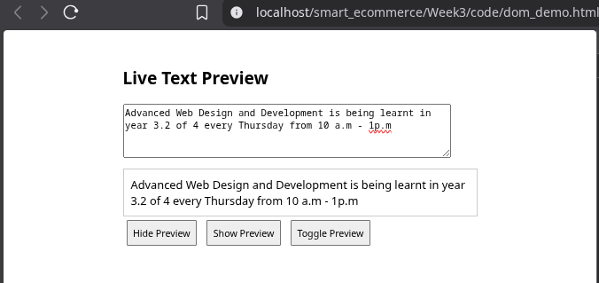

# Week 3 – JavaScript & Basic PHP Foundations

**Student:** Kennedy Karani  
**Registration:** BBIT/2024/56963  
**Date:** 2026-06-03

## Objective

Implementing client-side form validation with JavaScript, DOM manipulation, and basic PHP form processing.

## Step-by-Step Actions

### 1. JavaScript Form Validation

I Created `login.html` with:

- Email validation (non-empty and proper format).
- Password strength checker (weak <6, medium 6-7 with letters, strong >=8 with uppercase+number).
- Real-time error messages.

**Fig 1** – Validation errors
  
  
*Fig 1: Empty email and short password show red error messages.*

**Fig 2** – Password strength indicator
  
  
*Fig 2: "Strong password" appears when criteria met.*

### 2. PHP Form Processing

Created `process.php` to receive POST data and display a welcome message.

**Fig 3** – PHP output after form submission
  
  
*Fig 3: Shows submitted email and password length.*

### 3. Database Connection Test

Copied `db_test.php` from Week 1 and tested again.

**Fig 4** – Connection success
  
  
*Fig 4: Confirms PHP still connects to MariaDB.*

### 4. DOM Manipulation

Created `dom_demo.html` with live text preview and hide/show/toggle buttons.

**Fig 5** – Live preview
  
  
*Fig 5: Typed text appears instantly in preview div.*

## Reflection

This week I combined frontend JavaScript with backend PHP basics. I learned how to validate forms before submission to improve user experience. 
The password strength checker uses regex to evaluate complexity. On the PHP side, I processed the form data and displayed a simple welcome message. 
The DOM manipulation exercise showed how to change page content without reloading – useful for interactive interfaces.
All files are in `Week3/code/` and screenshots are labelled. Next week I will build a complete login system with sessions.
