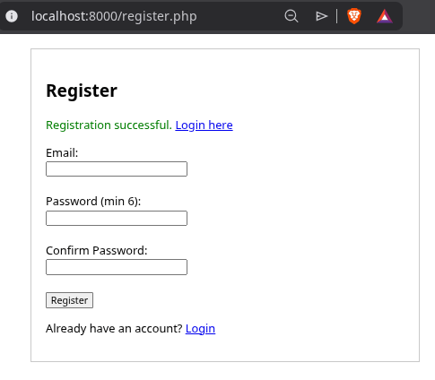
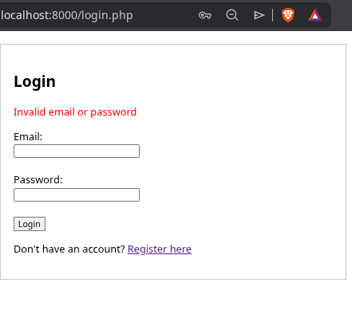
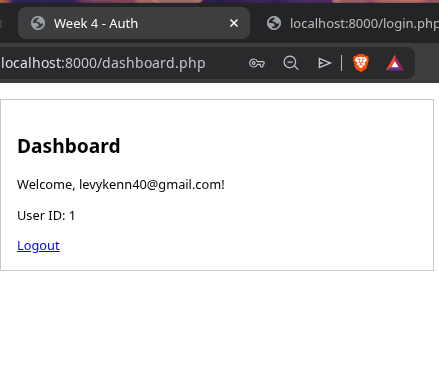
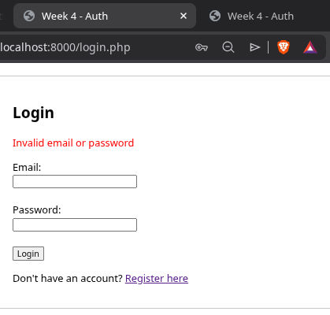
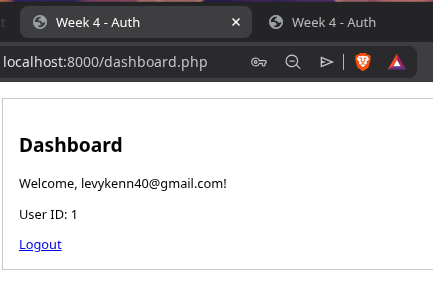

# Week 4 – Server‑Side Authentication

**Student:** Kennedy Karani  
**Registration:** BBIT/2024/56963  
**Date:** 2026-06-03

## Objective

Implementing user registration and login with secure password hashing, session management, and protected pages.

## Step-by-Step Actions

### 1. Database Setup

Created `users` table with `email` and `hashed password` columns.

### 2. Registration Page (`register.php`)

- Takes email, password, confirmation.
- Validates input, hashes password with `password_hash()`.
- Inserts into database.

**Fig 1** – Registration form
  

**Fig 4** – Validation error  

### 3. Login Page (`login.php`)

- Verifies email and password using `password_verify()`.
- Starts session on success.

**Fig 2** – Login form  

**Fig 5** – Login error  

### 4. Protected Dashboard

Checks session; redirects to login if not authenticated.

**Fig 3** – Dashboard (after login)  

### 5. Logout

Destroys session and redirects to login.

## Reflection

This week I built a secure authentication system using PHP sessions and password hashing. 
I learned that passwords should never be stored in plain text – `password_hash()` and `password_verify()` make it 
easy to implement. 

The registration page includes client‑side and server‑side validation. 
The dashboard page checks for a valid session before granting access. 
Using PHP’s built‑in server for testing was safe and avoided Apache configuration issues. Next week I will add full 
CRUD operations.
