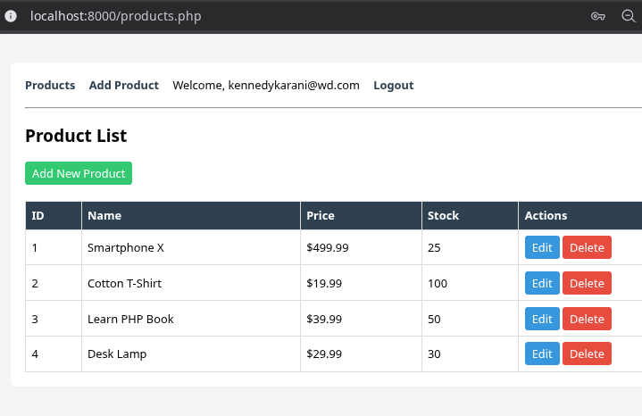
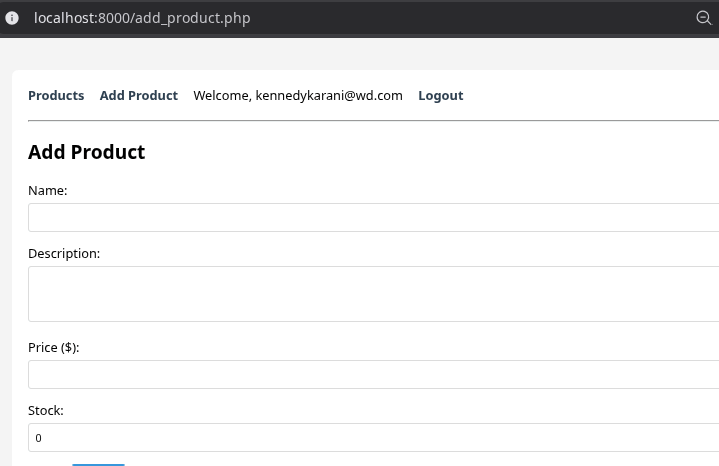
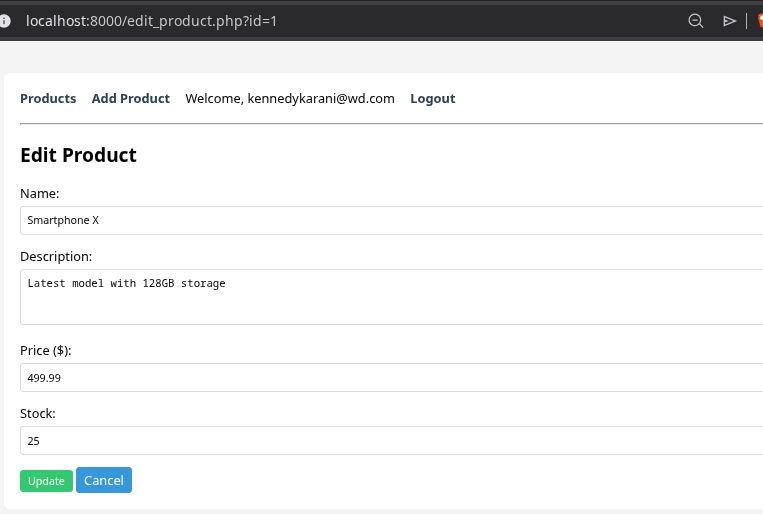
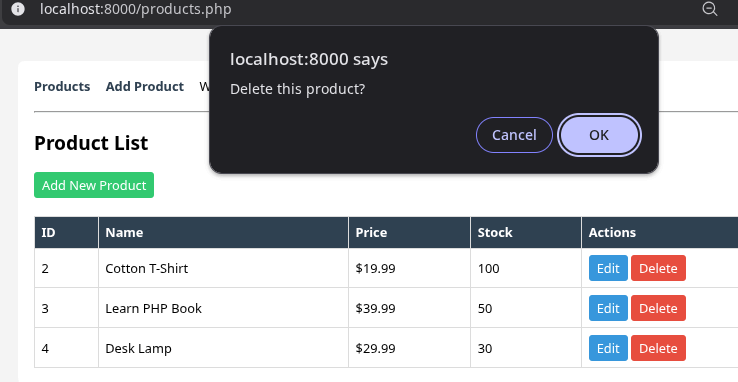
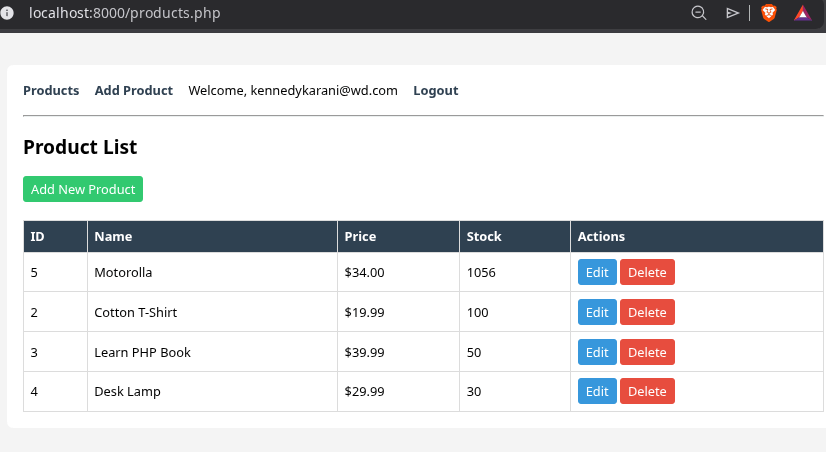

# Week 5 – CRUD Operations (Products)

**Student:** Kennedy Karani  
**Registration:** BBIT/2024/56963  
**Date:** 2026-06-03

## Objective

Implement full CRUD (Create, Read, Update, Delete) for a product catalog using PHP and MySQL (PDO). Integrate with the existing authentication system from Week 4.

## Step-by-Step Actions

### 1. Database Setup

Created a `products` table in `test_db` with columns: id, name, description, price, stock, created_at. Inserted four sample products.

### 2. Product Listing (Read)

`products.php` fetches all products and displays them in an HTML table with Edit and Delete links.  

**Fig 1** – Product list  

### 3. Add Product (Create)

`add_product.php` contains a form. On submission, it inserts a new record using a PDO prepared statement.  

**Fig 2** – Add product form  

### 4. Edit Product (Update)

`edit_product.php` loads the existing product data into a form. After submission, it updates the record.  

**Fig 3** – Edit product  

### 5. Delete Product (Delete)

`delete_product.php` receives an ID, runs a DELETE query, and redirects back to the product list. A JavaScript confirmation dialog prevents accidental deletion.  

**Fig 4** – Delete confirmation  

### 6. Final CRUD Success
After adding, editing, and deleting, the product list reflects all changes.  

**Fig 5** – Updated product list  

## Reflection (100 words)

This week I built a complete CRUD system for managing products. I used PDO with prepared statements to prevent SQL injection. 
The authentication from Week 4 was integrated so only logged‑in users can access the product pages. 
The process of adding, editing, and deleting records is the backbone of any data‑driven web application. 
I also improved the user interface with simple CSS. All code is in the `code/` folder and screenshots are labelled. 

Next, I will focus on enhancing the frontend with search and pagination.
